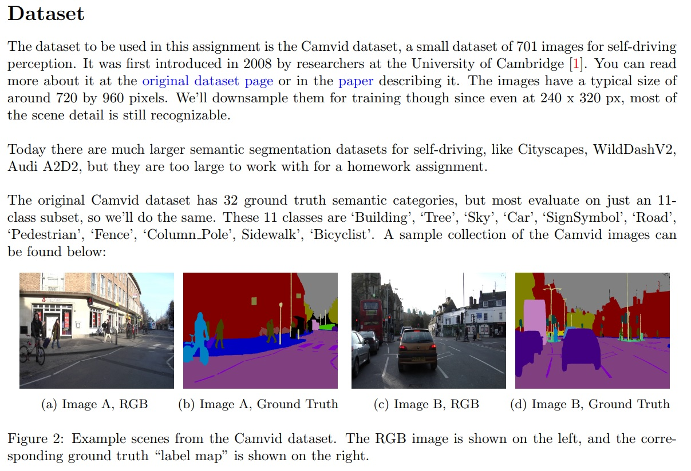

# Semantic Segmentation Deep Learning

## Utilize the Camvid dataset - a small dataset of 701 images for self-driving perception.

## Implement PSPNet by using ResNet backbone, but uses dilation to increase the receptive field, and aggregates context over different portions of the image with a "Pyramid Pooling Module"(PPM)

## Transfer Learning: Utilize the PSPNet trained on Camvid dataset as our pre-trained model and train it on KITTI road segmentation dataset.

## See the doc for more details

## Data

We implemented the PSPNet architecture. This network uses a ResNet backbone, but uses dilation to increase the receptive field, and aggregates context
over different portions of the image with a “Pyramid Pooling Module” (PPM).

Figure: PSPNet architecture. The Pyramid Pooling Module (PPM) splits the H × W feature map into KxK grids. Here, 1 × 1, 2 × 2, 3 × 3, and 6 × 6 grids are formed, and features are average-pooled within each grid cell. Afterwards, the 1 × 1, 2 × 2, 3 × 3, and 6 × 6 grids are upsampled back to the original H × W feature map resolution, and are stacked together along the channel dimension.

Figure: Dilation convolution. Figure source: https://github.com/vdumoulin/conv_arithmetic#dilated-convolution-animations
